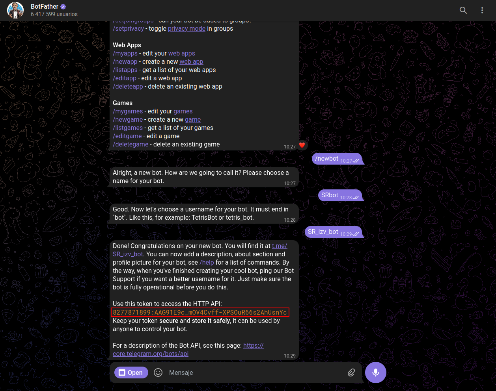
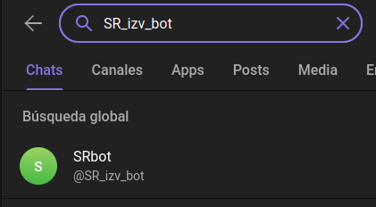
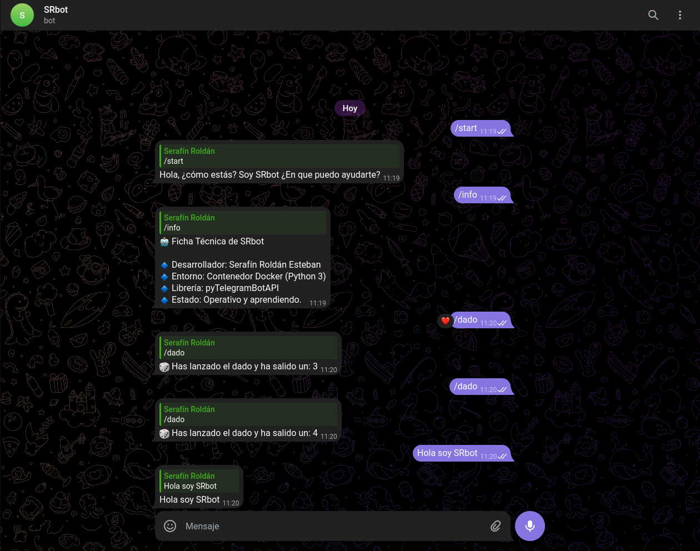

# Proyecto Telegram_bot

Este proyecto consiste en el desarrollo y despliegue de un bot de Telegram automatizado.

## Funcionalidades

A diferencia de una versión básica, este bot incluye lógica personalizada y comandos interactivos:

1.  **Bienvenida Personalizada**: Responde a los comandos `/start` y `/hola` con un saludo inicial.
2.  **Ficha Técnica (`/info`)**: Muestra información detallada sobre el desarrollador, el entorno de ejecución y el estado del servicio en tiempo real.
3.  **Generador de Azar (`/dado`)**: Utiliza la librería `random` de Python para devolver un número aleatorio entre 1 y 6.
4.  **Procesamiento de Mensajes (Echo)**: Captura cualquier entrada de texto y la devuelve al usuario.

## Tecnologías y Herramientas

* **Lenguaje:** [Python 3.12](https://www.python.org/)
* **Librería API:** `pyTelegramBotAPI`
* **Contenerización:** [Docker](https://www.docker.com/)

## Estructura del Proyecto

* `bot.py`: Código fuente con la lógica de los manejadores de mensajes.
* `Dockerfile`: Archivo para la construcción de la imagen del contenedor.
* `requirements.txt`: Dependencias necesarias para el proyecto.

## Instalación y Despliegue

### 1. Requisitos previos
Es necesario tener instalado **Docker** y una cuenta de Telegram para obtener un Token a través de [@BotFather](https://t.me/botfather).



### 2. Configuración de seguridad
Crea un archivo llamado `token.txt` en la raíz del proyecto y añade tu token de la siguiente forma:
```text
BOT_TOKEN=pon_tu_token_aqui
```

### 3. Construcción de la imagen
```bash
docker build -t telegram-bot-app .
```


### 4. Lanzamiento del contenedor
```bash
docker run -dti --env-file token.txt --name SRbot telegram-bot-app
```

## Verificación y Pruebas
Para asegurar el correcto funcionamiento del sistema, se han realizado las siguientes comprobaciones:

### 1. Busqueda de nuestro bot
En la lupa de búsqueda, escribimos el nombre de usuario que hemos elegido en BotFather (el que termina en _bot).
Lo seleccionamos en la lista de resultados para abrir el chat.



### 2. Pruebas de Comandos en Telegram
Se han testeado los manejadores de eventos configurados en `bot.py`:

* **Comando `/start`**: Verifica la conexión inicial y el saludo personalizado.
* **Comando `/info`**: Comprueba que el bot recupera correctamente los datos del desarrollador.
* **Comando `/dado`**: Prueba la integración de la librería `random` para generar respuestas aleatorias.
* **Función Echo**: Verifica que el bot escucha y procesa mensajes de texto plano.

